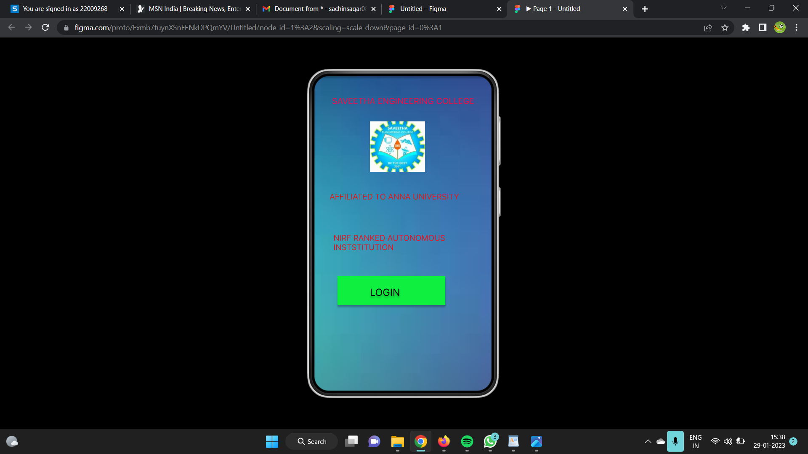
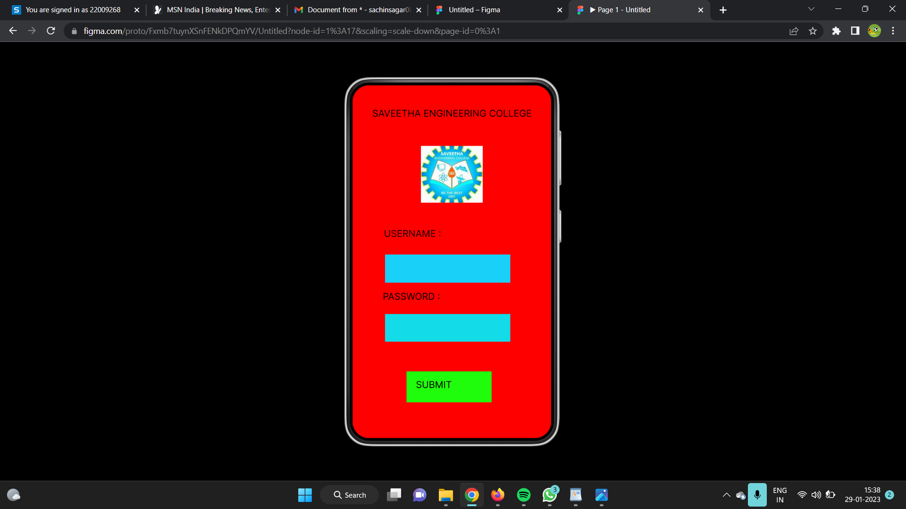
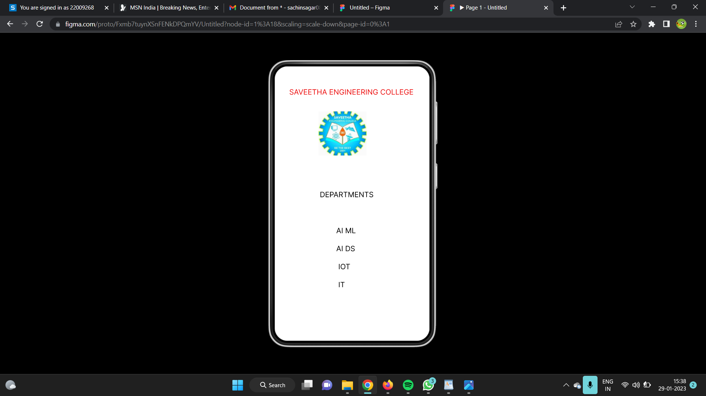

# Event Registration Web Application

## AIM:
To design, develop and deploy a web application for event registration.

## DESIGN TOOL:
Figma 

## Code :
```
/* Android Small - 1 */

position: relative;
width: 360px;
height: 640px;

background: #FFFFFF;
box-shadow: inset 0px 4px 4px rgba(0, 0, 0, 0.25);

/* Android Small - 2 */


position: relative;
width: 360px;
height: 640px;
background: #FF0000;

/* SAVEETHA ENGINEERING COLLEGE */
position: absolute;
width: 400px;
height: 78px;
left: 34px;
top: 49px;

font-family: 'Inter';
font-style: normal;
font-weight: 400;
font-size: 17px;
line-height: 21px;
color: #ED0D0D;

/* LOGO 1 */
position: absolute;
width: 112px;
height: 103px;
left: 102px;
top: 105px;

background: url(LOGO.jpg);

/* DEPARTMENTS AI ML AI DS IOT IT */
position: absolute;
width: 161px;
height: 32px;
left: 105px;
top: 288px;
font-family: 'Inter';
font-style: normal;
font-weight: 400;
font-size: 17px;
line-height: 21px;
color: #000000;
```
## OUTPUT:




## RESULT:
The program to design, develop and deploy a web application for event registration is completed successfully.
